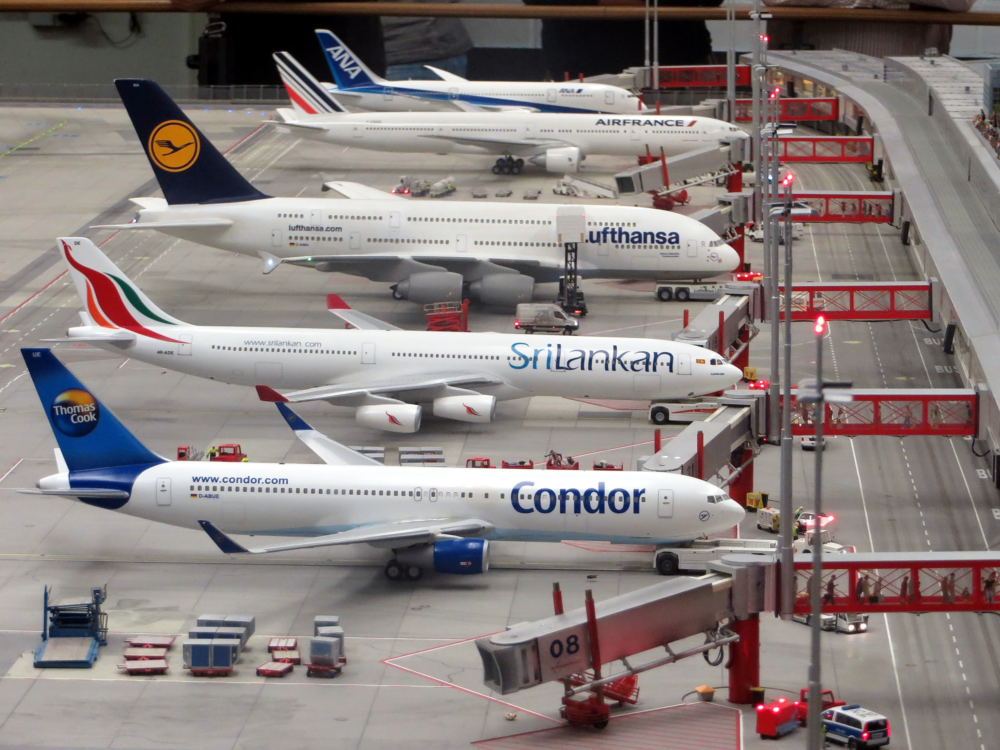
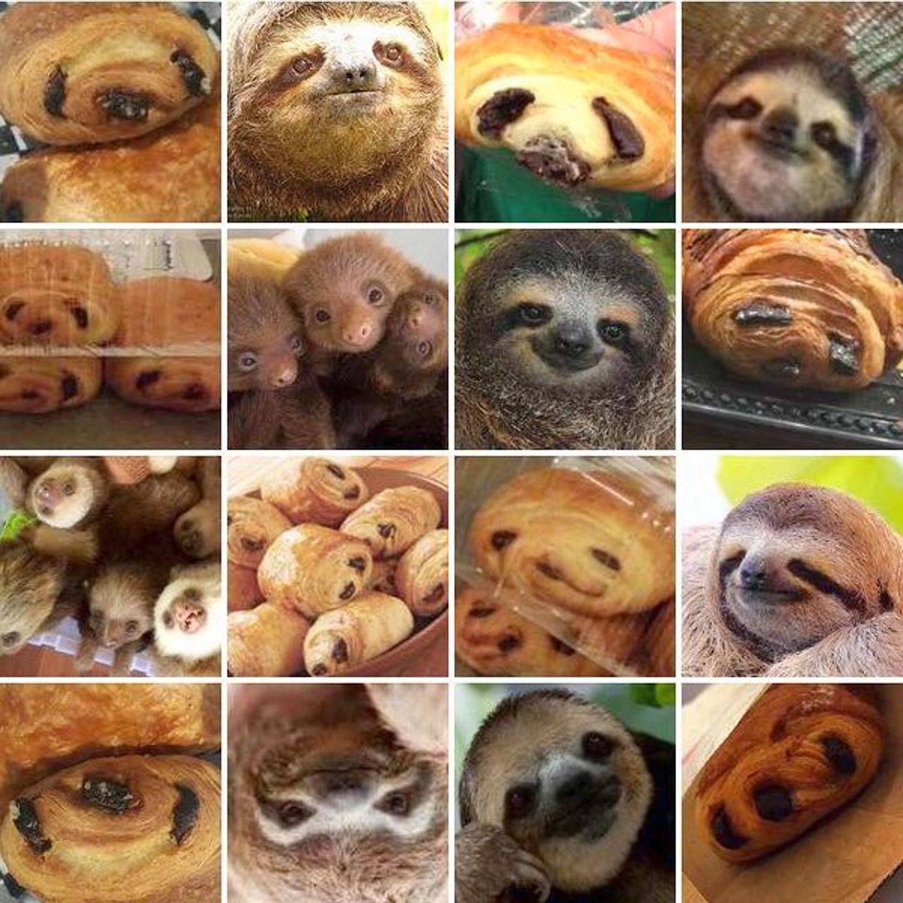

# AML-Labs

Labs for Azure Machine Learning based largely on examples and code from the [Azure Machine Learning Documentation](https://docs.microsoft.com/en-us/azure/machine-learning/preview/)

For an introduction to Azure Machine Learning please visit the official [What is Azure Machine Learning](https://docs.microsoft.com/en-us/azure/machine-learning/preview/overview-what-is-azure-ml) section.

## AML Setup

The seup required to make use of the Azure Machine Learning service. This is provided through the official [Install and create](https://docs.microsoft.com/en-us/azure/machine-learning/preview/quickstart-installation) documentation

## Labs 

### [1. AML Titanic Example](/1-AML-Titanic)

<a href="/1-AML-Titanic"></img></a>

This example is based on actual data from the Titanic catastrophe. In this example a classification algorithm is built that is able to predict, if a fictual person would have survived the Titanic accident.

### 2. Flight Delay Prediction

To predict possible flight delays, a regression model is trained real world data from flights all over the world.

### 3. Sloth recognition

In this example we check, if an image contains the majestic animal called sloth (see image above). We use a neural network to train on images of sloths and croissants (and other things).
